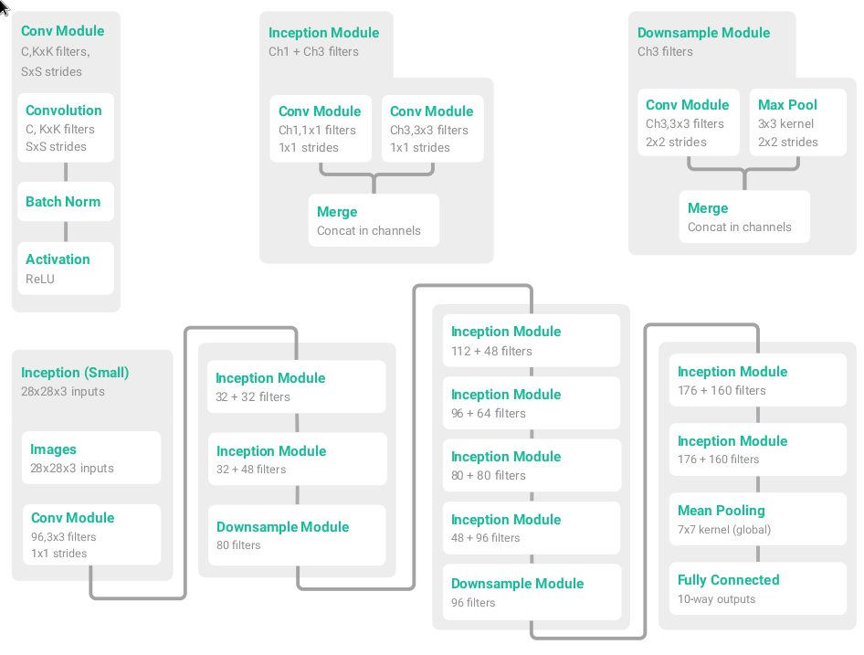

# PyTorch

## Using group GPUs

We have a number of group machines with GPUs for deep learning: Myrtle, Ned, Athena and Minerva. 

Today we will use Athena and Minerva which each have 4 GPUs. To connect, use ssh on the vlc shared account:

```
$ ssh vlc@athena.ecs
```

You will need to be connected to the VPN or on a machine which is physically connected.

To connect using windows, use Putty.

You can use the command:

```
tpl1g12@minerva:~$ nvidia-smi
```

to view current GPU usage and `htop` to view cpu and other resource usage.

When using the vlc account, please make a directory in home for your code etc. 

To run code, decide which GPU to use and run any python program like this:

```
$ CUDA_VISIBLE_DEVICES=X python train.py 
```

## Fundamentals + Autograd Basics
At the lowest level of abstraction, PyTorch is just a tensor library.
You can do things just like you can in Matlab or with the Python `numpy` library.
We will start with a simple logistic regression example.
In this example, we will do most things manually so that everything is explicit and you know what goes on under the hood.
In later examples, there will be higher-level abstractions that make life easier than this.

Note: You should keep the documentation at http://pytorch.org/docs/master/torch.html open and make sure that you understand what each function call to the `torch` module is doing.

The task is to classify whether a sample came from distribution 1 (target label 0) or distribution 2 (target label 1).
Both of these distributions are simple bivariate Gaussians with different means and identity covariance matrix.
First, let's generate some data.

```python
import torch


def generate_data(n):  # n is the number of samples to generate from each distribution
    mean1 = torch.Tensor([0, 0])
    mean2 = torch.Tensor([2, 1])

    data1 = torch.randn(n, 2) + torch.unsqueeze(mean1, dim=0)
    data2 = torch.randn(n, 2) + torch.unsqueeze(mean2, dim=0)
    labels1 = torch.zeros(n)
    labels2 = torch.ones(n)

    all_data = torch.cat([data1, data2], dim=0)
    all_labels = torch.cat([labels1, labels2], dim=0)

    permutation = torch.randperm(2 * n)
    shuffled_data = all_data[permutation]
    shuffled_labels = all_labels[permutation]

    return shuffled_data, shuffled_labels


data, labels = generate_data(100)
print('data', data)
print('labels', labels)
```

Run the program to see some data being printed out.

We can also go ahead and define a logistic regression model: a linear projection followed by a sigmoid.
For now, we just initialise the weights and the bias to small random numbers.

Fill in the initialisation for `weights` and `bias`.
`weights` should be a matrix of size 2x1 and `bias` should be a vector of size 1, both drawn from a normal distribution with mean 0 and standard deviation 0.01.

```python
weights = ...
bias = ...

def sigmoid(x):
    return 1 / (1 + (torch.exp(-x)))

def run(x):
    x = torch.mm(x.unsqueeze(0), weights) + bias
    x = sigmoid(x)
    return x


# do the evaluation
number_correct = 0
for sample, target in zip(data, labels):
    output = run(sample)

    # check whether output is the same as target
    correct = (torch.squeeze(output) > 0.5).data == target
    if correct:
        number_correct += 1

print(number_correct)
```

Run the program to see what the untrained model is currently outputting.
You can also put more print statements in the `run` function to see what the intermediate values are.

Now the magic of PyTorch comes in.
So far, we've only been using the CPU to do this computation.
It's really easy to use the GPU instead!
Insert the following before the `for` loop:

```python
data = data.cuda()
labels = labels.cuda()
weights = weights.cuda()
bias = bias.cuda()
```

Now everything runs on the GPU, without having to change anything else! You can see that it worked by the `cuda.FloatTensor` type and the `(GPU 0)` telling you on which GPU device it is.
While this model is so small that it's easily run on CPUs, that won't be the case for models in Deep Learning.
There will also be a simpler way of putting parameters on the GPU; you don't need to manually send every parameter to it in the future.

Next, we would like to actually train this model using gradient descent.
While we could compute the gradients manually, there is a much simpler solution that will also scale to massive models.
We will wrap the tensors in the `Variable` type, which will keep track of gradients for us.
You can always access the wrapped tensor with `.data`, but any operations you do with that won't have a tracked gradient.
Tensors wrapped in `Variable`s support almost the exact same operations as the tensors themselves: you can use all the familiar `torch.*` functions with them, add them, matrix-multiply them, and so on.
During these operations, the `Variable` will keep track of which operations were performed on the tensor, which allows you to backpropagate them.
When using `Variable`, tensors that don't need a gradient but are involved in the computation need to be wrapped in `Variables` too.
For the parameters that should be trained, pass the `requires_grad=True` argument to it to tell torch that these gradients should be tracked.

We will use a binary cross-entropy as loss function and let torch do the automatic differentiation.
Add this before the `for` loop:

```python
from torch.autograd import Variable

# wrap the tensors in Variables
data = Variable(data)
labels = Variable(labels)
weights = Variable(weights, requires_grad=True)
bias = Variable(bias, requires_grad=True)

def binary_crossentropy(prediction, true):
    return - true * torch.log(prediction) - (1 - true) * torch.log(1 - prediction)

def train(x, target):
    predicted = run(x)
    loss = binary_crossentropy(predicted, target)
    loss = torch.mean(loss)

    # compute the gradients
    loss.backward()

    # stochastic gradient descent with step size of 0.01
    # accessing .data is ok here because we don't want to differentiate through the SGD update anyway
    weights.data -= 0.1 * weights.grad.data
    bias.data -= 0.1 * bias.grad.data

    # clear the gradients for the next gradient update
    weights.grad.data.fill_(0)
    bias.grad.data.fill_(0)


# do the training
for epoch in range(10):
    for sample, target in zip(data, labels):
        train(sample, target)
```

Notice how we never had to tell it how to differentiate the loss explicitly.
Try to replace the binary cross-entropy loss with a mean squared error loss.


this is a bit of effort, replace with optim


we're done with the basics!

## NN Overview

We can also use PyTorch in a more general way of modules and layers so we can use existing implementations of things without writing them ourselves. The blocks of code for this look very similar to Keras or TensorFlow.

You can find the code for this in overview/train.py, but this document will explain block-by-block.

```python
import torch
import torchvision
import torchvision.transforms as transforms

from torch.autograd import Variable
import torch.nn as nn

import torch.optim as optim

from tqdm import tqdm

nEpoch = 2
```

These imports should be relatively straightforward. `torch` contains the base types that we worked with before, `torchvision` contains datasets and useful transforms (e.g. to normalise). Optimisers are in `optim` so that we don't have to rely on our own SGD implementation anymore. `tqdm` is just a nice library to make a progress bar.

We will be using the CIFAR10 dataset which is a small dataset of labelled 28x28 colour images. PyTorch makes this really simple:

```python
# The output of torchvision datasets are PILImage images of range [0, 1].
# We transform them to Tensors of normalized range [-1, 1]

transform = transforms.Compose(
    [transforms.ToTensor(),
     transforms.Normalize((0.5, 0.5, 0.5), (0.5, 0.5, 0.5))])

trainset = torchvision.datasets.CIFAR10(root='/datasets', train=True,
                                        download=True, transform=transform)
trainloader = torch.utils.data.DataLoader(trainset, batch_size=4,
                                          shuffle=True, num_workers=1)

testset = torchvision.datasets.CIFAR10(root='/datasets', train=False,
                                       download=True, transform=transform)
testloader = torch.utils.data.DataLoader(testset, batch_size=4,
                                         shuffle=False, num_workers=1)

classes = ('plane', 'car', 'bird', 'cat', 'deer', 'dog', 'frog', 'horse', 'ship', 'truck')
```

We use a dataset object which defines the dataset and apply a normalising transform to it. A loader is a generator which allows us to load a batch from the dataset. We use the standard CIFAR10 training/testing split. It is very easy to implement new datasets.

When sharing resources, `num_workers` is an important parameter as the machine is limited by CPU cores rather than GPUs. A small batch size is used for fast convergence.

Next, we define our model and put it on the GPU.

```python
class Net(nn.Module):
    def __init__(self):
        super(Net, self).__init__()
        self.conv1 = nn.Conv2d(3, 6, 5)
        self.pool = nn.MaxPool2d(2, 2)
        self.conv2 = nn.Conv2d(6, 16, 5)
        self.fc1 = nn.Linear(16 * 5 * 5, 120)
        self.fc2 = nn.Linear(120, 120)
        self.fc3 = nn.Linear(120, 10)
        self.relu = nn.ReLU()

    def forward(self, x):
        x = self.conv1(x)
        x = self.relu(x)
        x = self.pool(x)

        x = self.conv2(x)
        x = self.relu(x)
        x = self.pool(x)

        x = x.view(x.size(0), -1)

        x = self.fc1(x)
        x = self.relu(x)
        x = self.fc2(x)
        x = self.relu(x)
        x = self.fc3(x)
        return x


model = Net().cuda()
```

Every module inherits from `nn.module`. This should look relatively similar to the functional API in keras. One fundamental difference is that **every** time the network forward propagates, the function `forward()` is called. This is different from other frameworks where it is called once to build a graph which is then used. This means that you can put `print()` statements in to debug or `if` or other control statements to change your network iteration by iteration.

`x = x.view(x.size(0), -1)` is used to flatten the 2D tensor into a 1D tensor required by a fully connected layer.

The network as a whole is C -> ReLU-> MP -> C -> ReLU-> MP -> FC -> FC -> FC, similar to an AlexNet but much smaller.


Now let's train it:

```python
criterion = nn.CrossEntropyLoss()
optimizer = optim.SGD(model.parameters(), lr=0.001, momentum=0.9)

for epoch in range(nEpoch):  # loop over the dataset multiple times

    running_loss = 0.0
    trainloader = tqdm(trainloader)
    for i, data in enumerate(trainloader, 0):
        # get the inputs
        inputs, labels = data

        # wrap them in Variable
        inputs, labels = Variable(inputs).cuda(), Variable(labels).cuda()

        # zero the parameter gradients
        optimizer.zero_grad()

        # forward + backward + optimize
        outputs = model(inputs)
        loss = criterion(outputs, labels)
        loss.backward()
        optimizer.step()

        # print statistics
        running_loss = 0.99 * running_loss + 0.01 * loss.data[0]
        trainloader.set_postfix(loss=running_loss)

print('**** Finished Training ****')
```

We start by defining a loss and an optimizer and then enter a training loop. This is very different to other frameworks - in PyTorch you control the training loop. This makes it much easier to, say, save the weights on each iteration - you just save them in the loop. 

Inside the epoch loop we iterate over the training loader to form a second loop. This is one full look at the dataset without augmentation so is a true epoch. 

The inputs and labels must be wrapped in a `Variable` object to allow tracking of gradient.

The final part is to compute and update the gradients. This always follows the same pattern of zeroing the old gradients, forward propagating, calculating the loss, backpropagating to calculate the new gradients and then updating the weights with a step. A closer look at this block:

```python
				# zero the parameter gradients
        optimizer.zero_grad()
        # forward propagate (calculate the predicted outputs)
        outputs = model(inputs)
        # calculate loss
        loss = criterion(outputs, labels)
        # backward propagate
        loss.backward()
        # update the weights
        optimizer.step()
```

The model should now train and if you run it you should see the loss dropping down. But what have we actually achieved? We need to evaluate on the test set to find out. 

The code for this is very similar to the inside training loop - we are just performing forward propagation over a loader. We sum the correctly predicted classes (where the predictions match the labels from the loader):

```python
correct = 0
total = 0
for data in testloader:
    images, labels = data
    labels = labels.cuda()

    outputs = model(Variable(images).cuda())
    _, predicted = torch.max(outputs.data, 1)
    total += labels.size(0)
    correct += (predicted == labels).sum()

print('Accuracy of the modelwork on the 10000 test images: %d %%' % (
    100 * correct / total))
```

You should see that even with a really simple and small network, you can achieve relatively high testing accuracy (around 50%).

Just for completeness, we will look at which classes performed well and which didn't, just to show that we aren't just guessing:

```python
class_correct = list(0. for i in range(10))
class_total = list(0. for i in range(10))
for data in testloader:
    images, labels = data
    labels = labels.cuda()
    outputs = model(Variable(images).cuda())
    _, predicted = torch.max(outputs.data, 1)
    c = (predicted == labels).squeeze()
    for i in range(4):
        label = labels[i]
        class_correct[label] += c[i]
        class_total[label] += 1


for i in range(10):
    print('Accuracy of %5s : %2d %%' % (
        classes[i], 100 * class_correct[i] / class_total[i]))

```

Here, we iterate over the test loader again and forward propagate through our model (again) to make predictions. We then keep a tally of how many correct predictions there were for each class.

## Creating New Modules
yan
replace Linear

## Randomly Drop/Repeat Layers

One neat example of how PyTorch's imperative style can achieve something difficult in Keras/TF is to randomly drop or repeat layers.

Take the CIFAR10 example and modify it to repeat `fc2` a random number of times. For example:

```python
nRepeats = random.randint(1,5)
for i in range(nRepeats):
    x = self.fc2(x)
```

Remember to `import random`. It is unlikely that this will give better performance, however, with deeper networks a similar system has been proposed called Stochastic Depth Networks (https://arxiv.org/abs/1603.09382).

Implementing this in Keras would require building a graph for every possibility and synchronising weights between them. In PyTorch, however, we can put in control statements which are different on every forward propagation if we wish. The automatic differentiation will take care of differentiating each case too.


## Building More Complicated Networks

The network that we've already made is an AlexNet style network. It is sequential with 5x5 filters.

Let's expand it to a bigger AlexNet so we can get some better results:

```python
def __init__(self):
        super(Net, self).__init__()
        self.conv1 = nn.Conv2d(3, 96, 5)
        self.pool = nn.MaxPool2d(2, 2)
        self.conv2 = nn.Conv2d(96, 256, 5)
        self.fc1 = nn.Linear(256 * 5 * 5, 384)
        self.fc2 = nn.Linear(383, 192)
        self.fc3 = nn.Linear(192, 10)
        self.relu = nn.ReLU()
```

The `forward()` function stays the same, but if we look at it, a lot of the code, structures and ideas are repeated. It would be good to encapsulate this in a module. 

There is now a mistake in the module. The error will be in the `forward` function. Use:

```python
print(x.size())
```

and look at the tensor sizes of x as x propagates through the different layers. This debugging 'technique' is very familiar to most programmers and something that is impossible to do with other frameworks.

In PyTorch any amount of layers can be put into a separate module and run in the same way as a layer. Networks, modules and layers are all the same, interchangeable, idea.

```python
def forward(self, x):
        x = self.conv1(x)
        x = self.relu(x)
        x = self.pool(x)

        x = self.conv2(x)
        x = self.relu(x)
        x = self.pool(x)

        x = x.view(x.size(0), -1)

        x = self.fc1(x)
        x = self.relu(x)
        x = self.fc2(x)
        x = self.relu(x)
        x = self.fc3(x)
        return x
```

Here, the conv, relu, pool architecture is repeated. Write an AlexNetModule of the form:

```python
class AlexBlock(nn.Module):
  def __init__(self, inCh, outCh, K):
    super(AlexBlock, self).__init__()
    ...


  def forward(self, x):
    ...

    return x
```

Using `AlexBlock(3, 96, 5)` should implement the first 3 lines of the old `forward` function. It should be clear how to implement the rest of the network. Check that you get the same results as before.

This may seem trivial but consider a more complicated example such as a small Inception style network (reproduced from: https://arxiv.org/abs/1603.09382). (Sorry about the dodgy screenshot with my mouse in it)



Here, there are many blocks which are reused. The reusable blocks are the ones at the top of the diagram. Try implementing this network (or skip this if you like).

Here are some stubs for the raw modules. The conv module is already done to demonstrate:

```python
import torch
import torch.nn as nn
import torch.nn.functional as F

class ConvModule(nn.Module):
  def __init__(self, I,C,K,S, padding=(0,0)):
    super(ConvModule, self).__init__()
    # Channels, hidden units, kernel size
    self.conv = nn.Conv2d(I, C, kernel_size=K, stride=S, padding=padding)
    self.batchNorm = nn.BatchNorm2d(C, eps=0.001)

  def forward(self, x):
    x = self.conv(x)
    x = self.batchNorm(x)
    return F.relu(x, inplace=True)

class InceptionModule(nn.Module):
  def __init__(self, I,C1,C3):
    super(InceptionModule, self).__init__()
    ...

  def forward(self, x):
    ...

    # To merge two tensor y and z use a concatentation:
    outputs = [y, z]
    return torch.cat(outputs, 1)

class DownsampleModule(nn.Module):
  def __init__(self, I,C3):
    super(DownsampleModule, self).__init__()
    ...

  def forward(self, x):
    ...

```

Once you have these modules, the rest is just plumbing. Here is a start of the final module:

```python 
class SmallInception(nn.Module):
  def __init__(self):
    super(SmallInception, self).__init__()
    # Channels, hidden units, kernel size
    channels = 3
    self.conv1 = ConvModule(3,96,3,1)

    self.inc1_1 = InceptionModule(96,32,32)
    self.inc1_2 = InceptionModule(64,32,48)
    self.down1 = DownsampleModule(80,80)

    ...

  def forward(self, x):
    x = self.conv1(x)

    x = self.inc1_1(x)
    x = self.inc1_2(x)
    x = self.down1(x)

    ...

    return x
```

You can use this module in place of the old AlexNet module and get a much higher classification accuracy.

## Ensembles
Now that we have two good networks, AlexNet and Inception, let's ensemble them to improve our results.

This should be as simple as making a new model which has an instance of each network. The `forward()` method should perform the forward pass on each network, saving the result in two separate variables, say `y` and `z`. Adding these tensors gives an ensembled result.

```python
class Net(nn.Module):
    def __init__(self):
        super(Net, self).__init__()
        self.alex = Alex()
        self.inception = SmallInception()

    def forward(self, x):
        ...
        return x
```

It's a nice feature than `nn.Module`s and 'layers' are the same thing and can be used completely interchangeably - they both simply perform a tensor operation.

## Creating Optimizer
yan
sgd copy + something


## Adding Noise to Gradients

We haven't got around to writing this, but this is something that is incredibly difficult to do in Keras/TF. In PyTorch, however, you have direct access to the gradients - so try adding some noise proportional to the magnitude of the gradient to the gradient. This might help your optimizer move over local minima.
